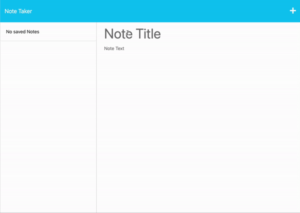

# Note Taker

## Description

This app allows users to create and store notes that persist on a backend server, so they're available anywhere with an internet connection.

Building the back-end for this app was the first time I've gotten deep into full-stack development. Connecting the front end index.js to the backend server.js was challenging at times, but has now provided me with a deeper understanding of how client and server interact.

## Usage

This app is deployed to Heroku at: [https://infinite-shelf-68467.herokuapp.com/](https://infinite-shelf-68467.herokuapp.com/)

Any saved notes are listed on the side bar to the left, and they can be deleted by clicking the trash can icon.

View this demo gif: 

## Credits

The front end was provided by Berekley Coding Bootcamp.

## License

The backend code is under the MIT license. See documentation in repo.
